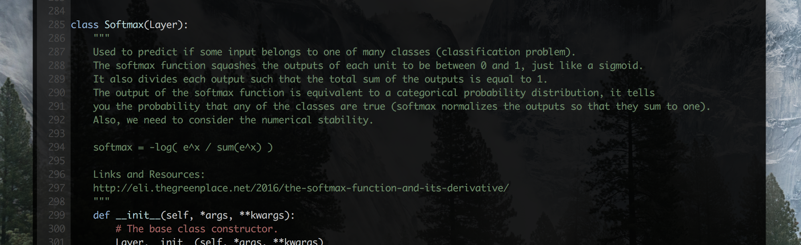
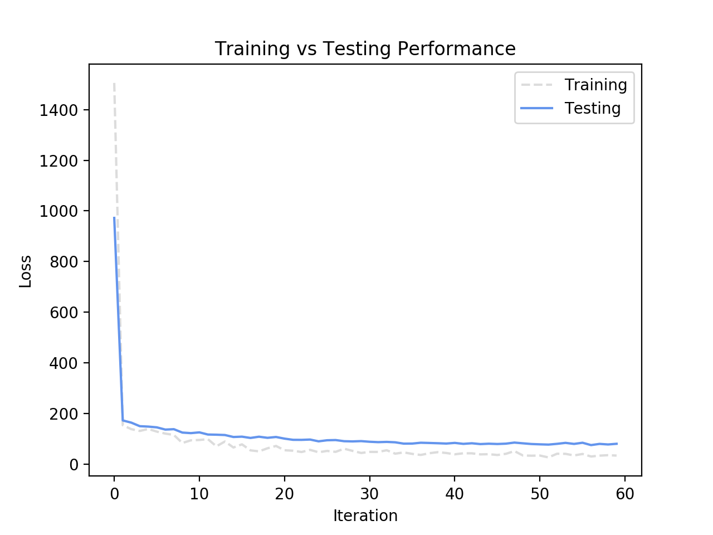

# MiniFlow
It's a tiny educative Deep Learning framework based on NumPy. The only purpose it to have a learning through play environment to understand how networks work internally. The code is extremely well documented and it's natural to follow and modify. Originally, it was a playground in a Udacity course, now it's fully utilizable for you ramp-up datasets.



> All we have to do is to come up with a way to find the weights that minimize the loss - Andrej Karpathy

## Usage Instalation
```bash
pip install --upgrade git+https://github.com/iuga/MiniFlow
```

## Development Instalation
```bash
# conda is required
./tools/install.sh
```

# What's next?
- First steps and examples:
  - [Boston Housing Example](./examples/Boston Housing Example.ipynb)
  - [Wine Quality Example](./examples/Wine Quality.ipynb)

## Deep dive into a regression problem
The dataset contains information collected by the U.S Census Service concerning housing in the area of Boston Mass.
First we should load the data using SkLearn and split it into training and validation sets:

```python
data = load_boston()
X = data['data']
y = data['target']

# Normalize data
X = (X - np.mean(X, axis=0)) / np.std(X, axis=0)

# Split between train/test sets:
X_train, X_test, y_train, y_test = train_test_split(X, y, test_size=0.20)
print("Shapes X_train: {} y_train:{} X_test:{} y_test:{}".format(X_train.shape, y_train.shape, X_test.shape, y_test.shape))
```
```bash
Shapes X_train: (404, 13) y_train:(404,) X_test:(102, 13) y_test:(102,)
```

Then we should crete the input placeholders and network trainable variables (weights and biases). Finally, contruct the network model and topology. Now we are ready to train it:
```python
# Neural network inputs (X and y):
Xi = Input(name="X_input")
yi = Input(name="y_input")

# Neural Network trainable parameter:
W1i, b1i = Variable(name="W1"), Variable(name="b1")
W2i, b2i = Variable(name="W2"), Variable(name="b2")

# Define the Network Topology
Xi = Input()
x = Linear(W1i, b1i)(Xi)
x = Sigmoid()(x)
x = Linear(W2i, b2i)(x)

# Define the model:
model = Model(inputs=[Xi], outputs=[x])
# Compile the model
model.compile(loss='mse')
# Train the model. History will return all the information:
history = model.train(X, y, epochs=60, batch_size=32, feed_dict = {
    W1i: W1,
    b1i: b1,
    W2i: W2,
    b2i: b2
})
```
```bash
Epoch 1:   [####################################]  100%
Train Loss: 250.873 - Test Loss: 162.021
Epoch 2:   [####################################]  100%
Train Loss: 25.638 - Test Loss: 28.772
Epoch 3:   [####################################]  100%
Train Loss: 23.033 - Test Loss: 27.322
...
Epoch 60:   [####################################]  100%
Train Loss: 5.642 - Test Loss: 13.396
```

Now let's analyze the results:
```python
import matplotlib.pyplot as plt

plt.figure()
plt.title("Training vs Testing Performance")
plt.xlabel("Iteration")
plt.ylabel("Loss")
plt_train, = plt.plot(history['train_loss'], '--', color="gainsboro", label='Training')
plt_test, = plt.plot(history['test_loss'], color='cornflowerblue', label='Testing')
plt.legend(handles=[plt_train, plt_test])
plt.show()
```

